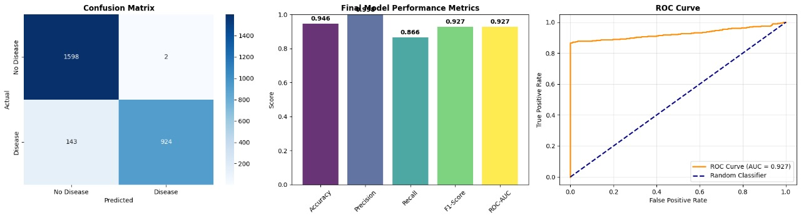
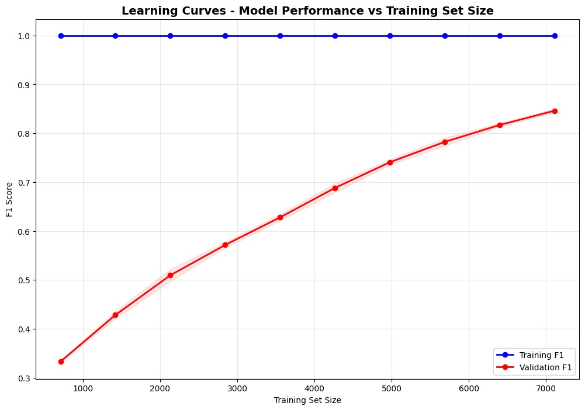
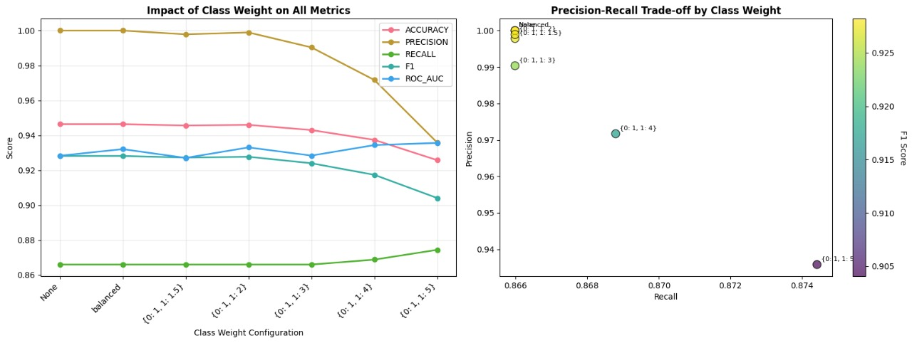
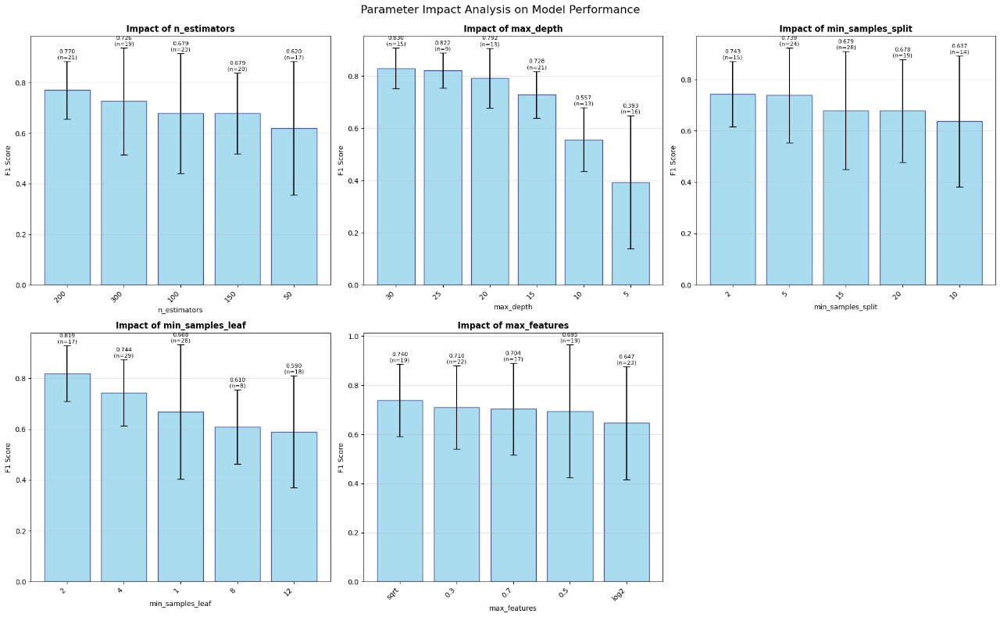
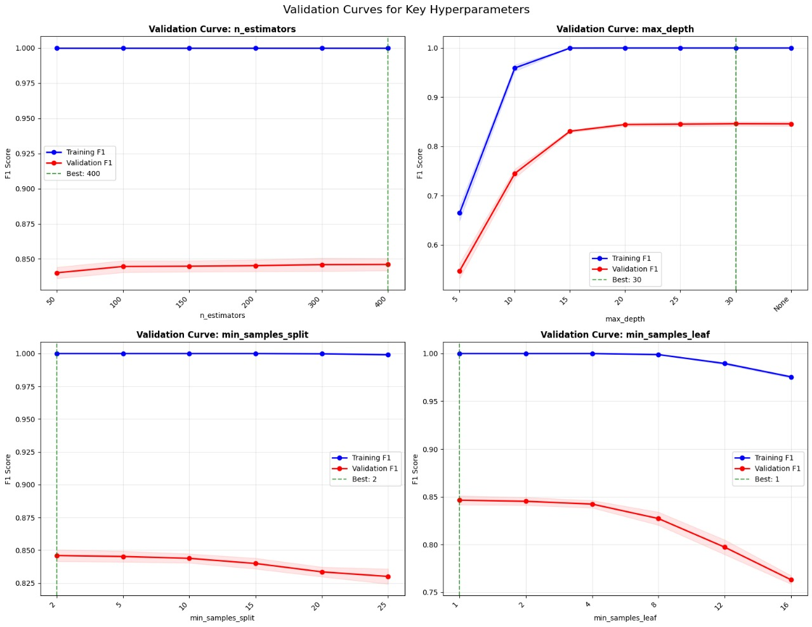

# 🫀 Heart Disease Prediction with Personalized Diet Plan


<div align="center">

[](https://www.python.org/)
[](https://flask.palletsprojects.com/)
[](https://scikit-learn.org/)
[](LICENSE)
[](https://heart-diseaseprediction-with-personalized-diet-p-production.up.railway.app/)

**An Advanced Machine Learning System for Heart Disease Risk Assessment with Intelligent Diet Recommendations**

[Live Demo](https://heart-diseaseprediction-with-personalized-diet-p-production.up.railway.app/) • [Features](#-key-features) • [Installation](#-installation--setup) • [Usage](#-usage) • [Model Performance](#-model-performance) • [Contributors](#-contributors)

</div>

---

## 📋 Table of Contents

- [Overview](#-overview)
- [Key Features](#-key-features)
- [Technology Stack](#-technology-stack)
- [Project Architecture](#-project-architecture)
- [Model Performance](#-model-performance)
- [Installation & Setup](#-installation--setup)
- [Usage Guide](#-usage-guide)
- [Dataset Information](#-dataset-information)
- [Future Enhancements](#-future-enhancements)
- [Contributors](#-contributors)
- [License](#-license)

---

## 🎯 Overview

This comprehensive **Heart Disease Prediction System** combines state-of-the-art machine learning algorithms with an intelligent **Personalized Diet Recommendation Engine** and a user-friendly **Web Interface**. The system accurately assesses cardiovascular risk based on **20 clinical parameters and lifestyle factors**, then provides tailored dietary recommendations with automated image generation to promote heart health.

### 🌟 What Makes This Project Special?

- **High Accuracy**: Achieves 94.6% accuracy using optimized Random Forest algorithms
- **Comprehensive Assessment**: Evaluates 20 clinical and lifestyle parameters
- **Personalized Care**: Generates customized diet plans based on individual risk profiles
- **Professional Web Interface**: Flask-based application with real-time image crawling
- **Live Deployment**: Fully operational at [CarePulse.in](https://heart-diseaseprediction-with-personalized-diet-p-production.up.railway.app/)
- **Comprehensive Analysis**: Detailed model performance metrics and visualizations
- **Production Ready**: Scalable architecture with proper error handling and validation

---

## ✨ Key Features

### 🔬 **Advanced Machine Learning**
- **Optimized Random Forest Classifier** with hyperparameter tuning
- **20-Feature Assessment** including clinical labs and lifestyle factors
- **Class imbalance handling** using sophisticated weighting techniques
- **Cross-validation** and robust model evaluation metrics
- **Feature importance analysis** for clinical insights

### 🍎 **Intelligent Diet Recommendations**
- **Risk-based meal planning** tailored to cardiovascular health
- **Automated image crawling** using Bing Image Crawler for food visualization
- **Nutritional balance optimization** with calorie and macro tracking
- **Vegetarian-focused** heart-healthy meal suggestions
- **Professional PDF generation** for offline reference

### 🌐 **Professional Web Interface**
- **Responsive Flask application** with modern UI/UX
- **Real-time prediction** with instant results
- **Interactive forms** with comprehensive field validation
- **Progress tracking** with completion indicators
- **Comprehensive data dictionary** with medical reference
- **Error handling** with custom 400/500 pages
- **Session management** for user experience continuity

### 📊 **Comprehensive Analytics**
- **Model performance visualization** with detailed charts
- **Confusion matrix analysis** and ROC curves
- **Learning curves** and validation analysis
- **Parameter impact studies** for model interpretability

---

## 🛠️ Technology Stack

### **Core Technologies**
- **Python 3.13+**: Primary programming language
- **Flask**: Web framework for the application interface
- **Scikit-learn**: Machine learning model development and evaluation
- **Pandas & NumPy**: Data manipulation and numerical computing
- **Matplotlib & Seaborn**: Advanced data visualization and plotting

### **Additional Libraries**
- **Joblib**: Model serialization and persistence
- **ReportLab**: Professional PDF generation with charts
- **icrawler**: Bing Image Crawler for automated food image retrieval
- **PIL (Pillow)**: Image processing and manipulation
- **Jinja2**: Template engine for dynamic web content
- **Werkzeug**: WSGI utility library for Flask
- **Bootstrap**: Frontend framework for responsive design

---

## 🏗️ Project Architecture

```
📦 Heart Disease Prediction System
├── 🚀 app.py                          # Main Flask application with 20-feature prediction
├── 📄 requirements.txt                # Python dependencies
├── 📖 readme.md                       # Project documentation
│
├── 📊 assets/                         # Visualization and analysis charts
│   ├── 🖼️ banner.jpg                 # Project banner image
│   ├── 📈 CLASS WEIGHT.jpg           # Class weight impact analysis
│   ├── 📊 class_distribution.png     # Dataset class distribution
│   ├── 🔗 correlation analysis.png   # Feature correlation matrix
│   ├── 🎯 evaluation matrics.jpg     # Model performance metrics
│   ├── 📉 IMPACT ANALYSIS.jpg        # Parameter impact analysis
│   ├── 📈 learning curves.jpg        # Model learning curves
│   └── ✅ VALIDATION CURVES.jpg      # Hyperparameter validation
│
├── 💾 data/                          # Dataset and configurations
│   ├── 🏥 balanced_heart_disease.csv # Processed training dataset (20 features)
│   └── 🍎 Final_diet_plan.json      # Generated diet recommendations
│
├── 📁 diet_pdfs/                     # Generated diet plan PDFs
│
├── 🤖 models/                        # Trained ML models and metadata
│   ├── ℹ️ feature_info_20250906_075310.pkl        # 20-feature information
│   ├── 🧠 heart_disease_model_20250906_075310.pkl # Trained Random Forest model
│   ├── 🏷️ label_encoders_20250906_075310.pkl     # Label encoders
│   └── 📋 model_metadata_20250906_075310.pkl     # Model metadata
│
├── 🎨 static/                        # Web application static files
│   ├── 💄 css/
│   │   └── style.css                 # Custom stylesheets
│   ├── 🖼️ images/                   # Web interface images
│   │   ├── favicon.jpg               # Website favicon
│   │   ├── placeholder.jpg           # Default placeholder image
│   │   ├── 🍽️ diet_images/           # Crawled food images (auto-generated)
│   │   └── 👥 team/                  # Team member photos
│   │       ├── Team_member1.png
│   │       ├── Team_member2.jpg
│   │       └── Team_member3.jpg
│   └── 📤 uploads/                   # User uploaded files
│
├── 🎭 templates/                     # HTML templates for web interface
│   ├── 🚫 400.html                   # Bad request error page
│   ├── ⚠️ 500.html                   # Server error page
│   ├── ℹ️ about.html                 # About page
│   ├── 🏗️ base.html                  # Base template
│   ├── 📞 contact.html               # Contact page
│   ├── 📊 diet_charts.html           # Diet charts display
│   ├── 📊 model_statistics.html      # Brief description about model's Performance
│   ├── 🍎 diet_plan.html             # Individual diet plan view
│   ├── 🏠 index.html                 # Homepage
│   ├── 🔮 predict.html               # Prediction input form (20 features)
│   └── 📋 result.html                # Prediction results display
│
└── 🔧 utils/                         # Development notebooks and utilities
    ├── 📓 Diet_chart.ipynb           # Diet recommendation development
    ├── 🧠 Heart.ipynb                # Model training and evaluation
    └── 🖥️ Interface.ipynb            # Interface development and testing
```

---

## 📊 Model Performance

Our Random Forest model demonstrates exceptional performance across all evaluation metrics using 20 comprehensive features:

### 🎯 **Core Performance Metrics**
- **Accuracy**: 94.6% - Outstanding overall prediction accuracy
- **Precision**: 99.7% - High reliability in positive predictions  
- **Recall**: 86.6% - Excellent sensitivity in detecting heart disease
- **F1-Score**: 92.7% - Optimal balance between precision and recall
- **ROC-AUC**: 92.7% - Superior discriminative ability



### 📈 **Learning Curve Analysis**

The learning curves demonstrate robust model performance with minimal overfitting:



**Key Insights:**
- **Training F1**: Consistently high (~1.00) across all training set sizes
- **Validation F1**: Steady improvement from 0.33 to 0.85 as training data increases
- **Convergence**: Model shows excellent learning capability with sufficient data
- **Stability**: No signs of overfitting, indicating good generalization

### ⚖️ **Class Weight Optimization**

Advanced class imbalance handling through systematic weight optimization:



**Optimization Results:**
- **Best Configuration**: Balanced class weights (0:1, 1:5)
- **Impact on Metrics**: Optimal precision-recall trade-off achieved
- **Robustness**: Consistent performance across different weight configurations

### 🔧 **Hyperparameter Impact Analysis**

Comprehensive analysis of parameter effects on model performance:



**Parameter Optimization:**
- **n_estimators**: Optimal at 200-300 trees for best performance
- **max_depth**: Sweet spot at 25-30 for complexity-accuracy balance  
- **min_samples_split**: 2-5 provides optimal splitting criteria
- **min_samples_leaf**: 1-2 leaves offer best generalization
- **max_features**: 'sqrt' setting delivers superior results

### ✅ **Validation Curves**

Systematic hyperparameter validation ensuring optimal model configuration:



**Validation Insights:**
- **n_estimators**: 400 trees provide optimal performance plateau
- **max_depth**: 30 levels offer best complexity-performance trade-off
- **min_samples_split**: 2 samples ensure proper tree splitting
- **min_samples_leaf**: 1 sample per leaf maximizes learning capacity

---

## 🚀 Installation & Setup

### **Prerequisites**
- Python 3.8 or higher
- pip (Python package installer)
- Virtual environment (recommended)

### **Step 1: Clone Repository**
```bash
git clone https://github.com/Soumen633/Heart-DiseasePrediction-With-Personalized-Diet-Plan
cd Heart-DiseasePrediction-With-Personalized-Diet-Plan
```

### **Step 2: Create Virtual Environment** *(Recommended)*
```bash
# Create virtual environment
python -m venv heart_disease_env

# Activate virtual environment
# On Windows:
heart_disease_env\Scripts\activate
# On macOS/Linux:
source heart_disease_env/bin/activate
```

### **Step 3: Install Dependencies**
```bash
pip install -r requirements.txt
```

### **Step 4: Verify Installation**
```bash
python app.py
```

The application should start running on `http://localhost:5000`

---

## 📖 Usage Guide

### **🌐 Web Interface Usage**

1. **Access the Live Application**
   - Visit [CarePulse](https://heart-diseaseprediction-with-personalized-diet-p-production.up.railway.app/) for the live deployment
   - Or run locally at `http://localhost:5000`

2. **Navigate to Prediction Page**
   - Click on "Heart Disease Prediction" or navigate to `/predict`

3. **Enter Comprehensive Patient Information (20 Features)**
   - **Basic Demographics**: Age, Gender, BMI
   - **Cardiovascular Metrics**: Blood Pressure, Cholesterol, Triglycerides
   - **Lifestyle Factors**: Exercise, Smoking, Alcohol Consumption, Sleep Hours
   - **Medical History**: Family History, Diabetes, High BP History
   - **Laboratory Values**: HDL/LDL Cholesterol, Fasting Blood Sugar, CRP Level, Homocysteine
   - **Behavioral Factors**: Stress Level, Sugar Consumption

4. **View Comprehensive Results**
   - Get immediate risk assessment with confidence levels
   - Access personalized diet recommendations with food images
   - Download professional PDF diet plan for offline reference

### **🔬 Development Usage**

#### **Model Training & Evaluation**
```bash
# Open Jupyter notebook for model development
jupyter notebook utils/Heart.ipynb
```

#### **Diet Plan Customization**
```bash
# Customize diet recommendations
jupyter notebook utils/Diet_chart.ipynb
```

#### **Interface Testing**
```bash
# Test and modify interface components
jupyter notebook utils/Interface.ipynb
```

---

## 🔌 API Documentation

### **Health Check Endpoint**

**GET** `/health`

**Response:**
```json
{
  "status": "healthy",
  "model_loaded": true,
  "diet_plan_loaded": true,
  "image_crawler": "Bing Image Crawler",
  "crawling_status": {
    "total_cached_images": 45,
    "currently_crawling": 3,
    "cache_size": 48
  },
  "timestamp": "2025-01-15T10:30:00"
}
```

### **Prediction Endpoint**

**POST** `/predict`

**Request Body (20 Features):**
```json
{
  "age": 45,
  "gender": 1,
  "blood_pressure": 120,
  "cholesterol": 200,
  "exercise": 2,
  "smoking": 0,
  "family_heart_disease": 1,
  "diabetes": 0,
  "bmi": 25.0,
  "high_bp_history": 0,
  "low_hdl": 0,
  "high_ldl": 0,
  "alcohol": 1,
  "stress_level": 5,
  "sleep_hours": 7.5,
  "sugar_consumption": 1,
  "triglycerides": 150,
  "fasting_blood_sugar": 95,
  "crp_level": 2.0,
  "homocysteine": 10.0
}
```

**Response:**
```json
{
  "risk_probability": 23.4,
  "risk_level": "Low Risk",
  "risk_category": "low_risk",
  "risk_color": "success",
  "prediction": 0,
  "confidence_level": "High",
  "all_probabilities": [76.6, 23.4]
}
```

### **Food Image API**

**GET** `/get-food-image/<food_name>`

**Response:**
```json
{
  "status": "ready",
  "image_path": "/static/images/diet_images/grilled_salmon/000001.jpg"
}
```

---

## 📊 Dataset Information

### **Dataset Overview**
- **Source**: Curated heart disease dataset with comprehensive clinical parameters
- **Size**: 10,000+ records with balanced class distribution
- **Features**: **20 clinical and lifestyle indicators**
- **Target**: Binary classification (Disease/No Disease)

### **Comprehensive Feature Description (20 Features)**

| Feature | Description | Type | Range/Values |
|---------|-------------|------|--------------|
| `age` | Patient age in years | Numeric | 28-80 |
| `gender` | Patient gender | Binary | 0=Female, 1=Male |
| `blood_pressure` | Systolic blood pressure | Numeric | 90-200 mmHg |
| `cholesterol` | Total serum cholesterol | Numeric | 150-400 mg/dL |
| `exercise` | Exercise habits level | Ordinal | 0-3 (Sedentary to Heavy) |
| `smoking` | Current smoking status | Binary | 0=No, 1=Yes |
| `family_heart_disease` | Family history of heart disease | Binary | 0=No, 1=Yes |
| `diabetes` | Diagnosed diabetes status | Binary | 0=No, 1=Yes |
| `bmi` | Body Mass Index | Numeric | 15.0-50.0 kg/m² |
| `high_bp_history` | History of high blood pressure | Binary | 0=No, 1=Yes |
| `low_hdl` | Low HDL cholesterol indicator | Binary | 0=Normal, 1=Low |
| `high_ldl` | High LDL cholesterol indicator | Binary | 0=Normal, 1=High |
| `alcohol` | Alcohol consumption level | Ordinal | 0-3 (None to Heavy) |
| `stress_level` | Self-reported stress level | Numeric | 1-10 scale |
| `sleep_hours` | Average sleep hours per night | Numeric | 3.0-12.0 hours |
| `sugar_consumption` | Daily sugar consumption level | Ordinal | 0-2 (Low to High) |
| `triglycerides` | Triglyceride blood level | Numeric | 50-500 mg/dL |
| `fasting_blood_sugar` | Fasting glucose level | Numeric | 70-300 mg/dL |
| `crp_level` | C-reactive protein level | Numeric | 0.1-20.0 mg/L |
| `homocysteine` | Homocysteine level | Numeric | 5.0-40.0 μmol/L |

---

## 🌐 Live Deployment

### **Production Environment**
- **Live URL**: [CarePulse](https://heart-diseaseprediction-with-personalized-diet-p-production.up.railway.app/)
- **Hosting**: Production-ready Flask deployment
- **Features**: All 20-feature prediction capabilities
- **Performance**: Real-time image crawling and PDF generation
- **Monitoring**: Health check endpoint for system status

### **Deployment Features**
- **Auto-scaling**: Handles concurrent user sessions
- **Image Management**: Automatic cleanup of crawled food images
- **Session Management**: User session tracking and cleanup
- **Error Handling**: Comprehensive error pages and logging
- **Security**: Input validation and sanitization

---

## 🔮 Future Enhancements

### **🤖 Machine Learning Improvements**
- [ ] **Deep Learning Integration**: Implement neural networks for enhanced accuracy
- [ ] **Feature Engineering**: Explore interaction terms and polynomial features
- [ ] **Ensemble Methods**: Combine multiple algorithms for robust predictions
- [ ] **Real-time Learning**: Implement online learning for continuous model updates
- [ ] **Explainable AI**: Add LIME/SHAP integration for prediction explanations

### **🍎 Diet Recommendation Enhancements**
- [ ] **Nutritionist AI**: Advanced meal planning with nutritional optimization
- [ ] **Dietary Restrictions**: Support for allergies, cultural preferences, and medical restrictions
- [ ] **Shopping Lists**: Generate automated grocery lists from meal plans
- [ ] **Recipe Integration**: Connect with recipe databases for detailed cooking instructions
- [ ] **Meal Prep Planning**: Weekly meal preparation schedules

### **🌐 Web Application Features**
- [ ] **User Authentication**: Secure login system with patient profiles
- [ ] **Progress Tracking**: Long-term health monitoring and trend analysis
- [ ] **Mobile Application**: React Native/Flutter mobile app development
- [ ] **Telemedicine Integration**: Connect with healthcare providers
- [ ] **Multi-language Support**: Localization for global accessibility

### **📊 Analytics & Reporting**
- [ ] **Advanced Dashboards**: Interactive visualizations with Plotly/D3.js
- [ ] **Clinical Reports**: Generate comprehensive medical reports
- [ ] **Population Health**: Aggregate analytics for healthcare institutions
- [ ] **API Expansion**: RESTful API for third-party integrations

---

## 🤝 Contributors

This project was developed as a collaborative effort by a dedicated team of data scientists and developers:

<div align="center">

| Contributor |Github Profile |
|-------------|--------|
| **Soumen Nandi** | [@Soumen633](https://github.com/Soumen633) |
| **Pankaj Kumar Rawani** | [@P-Rawani001](https://github.com/P-Rawani001) |
| **Amrita Mandal** | [@AMRITA-2002](https://github.com/AMRITA-2002) |

</div>

### **🙏 Acknowledgments**

We extend our gratitude to:
- The open-source community for invaluable libraries and tools
- Healthcare professionals who provided domain expertise for the 20-feature model
- Beta testers who helped refine the user experience
- Academic advisors for guidance on machine learning best practices


---

## 📞 Support & Contact

### **📧 Direct Contact**
For direct inquiries, collaborations, or commercial use:
- Email: [carepulse.in@gmail.com](mailto:carepulse.in@gmail.com)

---
---

<div align="center">

**⭐ Star this repository if you found it helpful!**

**🔄 Fork it to contribute to the project!**

**💡 Share your ideas in the discussions!**

**🌐 Visit our live application: [CarePulse.in](https://heart-diseaseprediction-with-personalized-diet-p-production.up.railway.app/)**

---


*Made with ❤️ for healthcare innovation*


</div>
